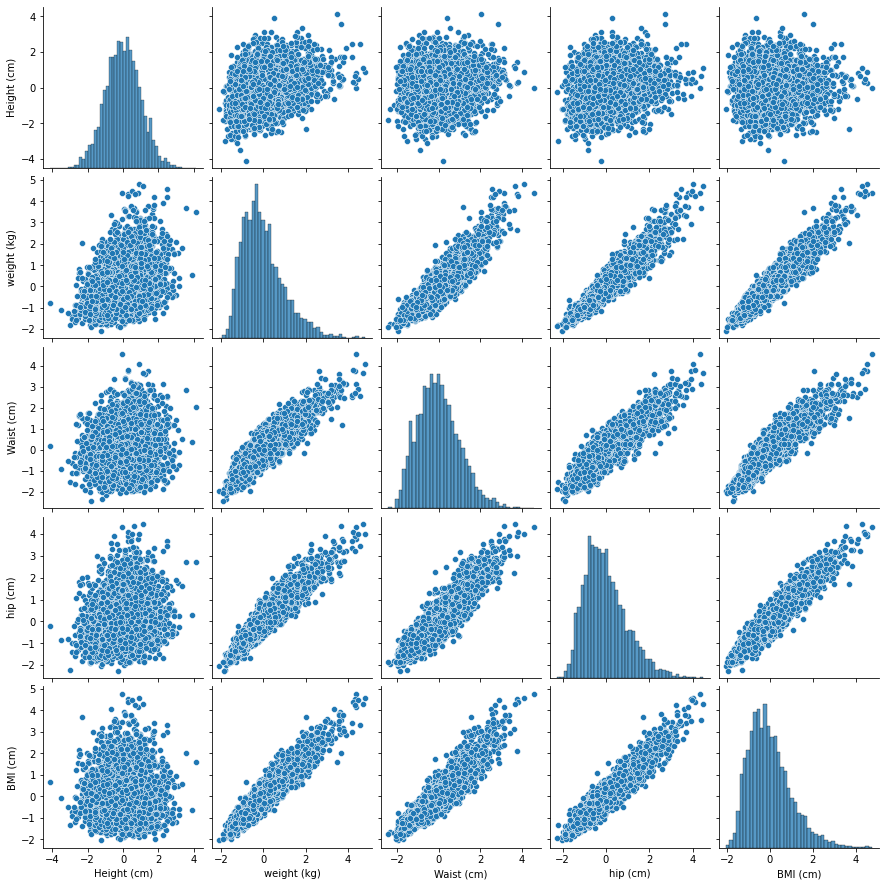

# Exploring BMI Trends: A Comparative Analysis of Male and Female Attributes

## Project Description

This project analyzes body mass index (BMI) trends using datasets for male and female individuals. It utilizes histograms, box plots, and aggregate functions to examine distributions and dispersion. The analysis includes Spearman and Pearson correlations among standardized physical attributes such as height, weight, waist, and hip size. Visualizations highlight key relationships and differences across genders.

## Table of Contents

- [Project Description](#project-description)
- [Data Sources](#data-sources)
- [Visualizations](#visualizations)
- [Conclusions](#conclusions)

## Data Sources

The datasets used in this analysis are publicly available:

- [Adult Female Dataset](https://raw.githubusercontent.com/gagolews/teaching-data/master/marek/nhanes_adult_female_bmx_2020.csv)
- [Adult Male Dataset](https://raw.githubusercontent.com/gagolews/teaching-data/master/marek/nhanes_adult_male_bmx_2020.csv)

## Visualizations

### Box-and-Whisker Plot of Female and Male BMIs

### Heatmap of Spearman and Pearson Correlations

### Pairplot for Female Dataset

## Conclusions
The analysis reveals that both male and female BMI datasets exhibit positive skewness, with the female dataset showing greater dispersion. Key correlations among physical attributes are highlighted, with weight showing strong associations with waist, hip size, and BMI, providing insights into gender-based differences in body metrics.
